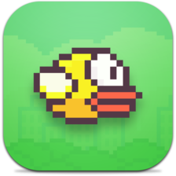

# FlappyBird  
## Uma aplicação semelhante ao jogo FlappyBird, desenvolvida em programação nativa ANDROID e utilizando a biblioteca BadLogic.
#### Curso: "Desenvolvimento Android Completo - Aprenda a criar 18 Apps - UDEMY"

*P.S.: Aguarde o GIF carregar totalmente para vizualizar o funcionamento perfeitamente.*

